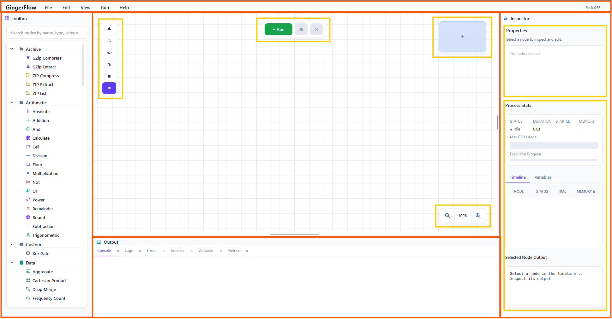
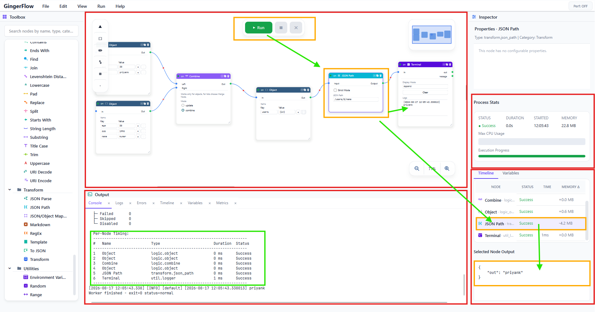
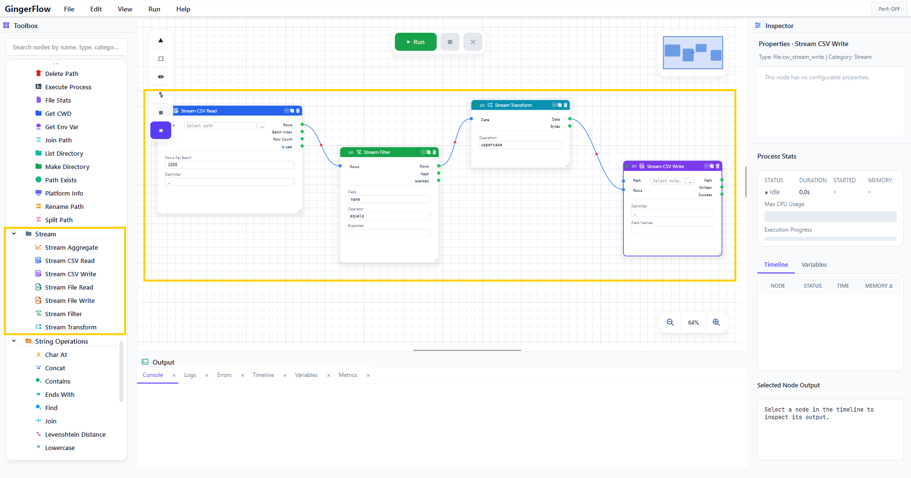
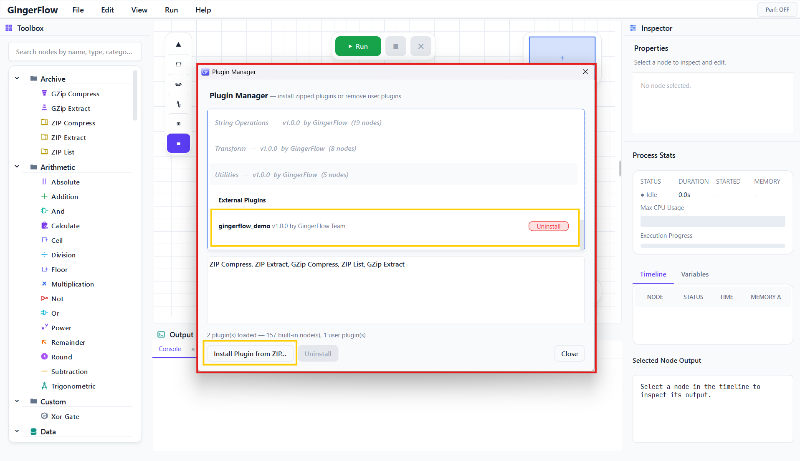
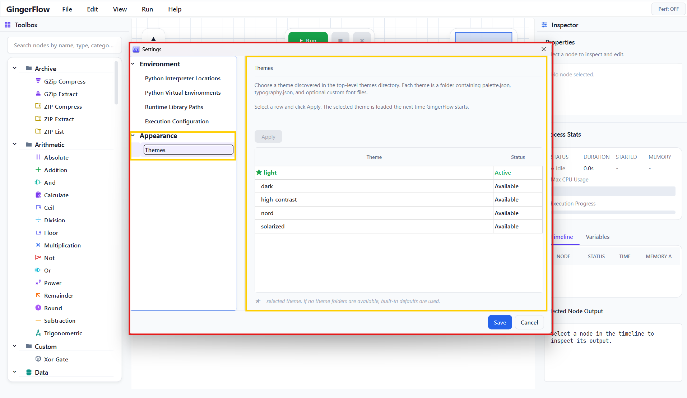

# GingerFlow

**A desktop visual workflow engine for building, executing, packaging, and reusing data workflows.**

GingerFlow combines a Qt 6 node editor with a validated DAG runtime, a headless worker, built-in automation nodes, streaming file pipelines, reusable custom subflows, and hot-loaded Python plugins.

Build a workflow visually. Inspect every execution. Turn a proven section into a reusable node. Run it from the desktop or headlessly in a worker process.

From a simple two-node automation to a multi-stage data pipeline, GingerFlow gives you a rich vocabulary of ready-to-use building blocks and a plugin boundary that lets you keep expanding the system without modifying the core application.

## Why GingerFlow

- **Visual first:** compose workflows by placing nodes, connecting typed ports, and configuring values directly on the canvas.
- **Reusable by design:** club any connected section of a flow into a reusable node in the `Custom` category.
- **Large-file aware:** process binary files and CSV data in bounded chunks or row batches instead of loading an entire dataset into RAM.
- **Extensible:** install ZIP-packaged Python plugins without recompiling the application.
- **Inspectable:** follow node starts, finishes, failures, timing, memory deltas, output previews, and workflow state in real time.
- **Automation-ready:** use the standalone worker for headless execution, CI jobs, scripts, and service-style workflows.
- **Defensive runtime:** validate graph structure, reject malformed edges, isolate run state, support cancellation, retry failed nodes, and capture crashes.
- **Themeable:** ship and switch between named themes with palette tokens, typography, icons, and derived theme inheritance.
- **Built for possibilities:** combine the existing node library, custom subflows, streaming batches, Python libraries, external tools, databases, APIs, files, and event-driven listeners into workflows tailored to your domain.

## Screenshots

The screenshots below are organized by topic and can be replaced with captured application images as the UI documentation evolves.

### Visual Workflow Authoring

<p><em>Canvas, Toolbox, node configuration, connections, minimap, and viewport controls.</em></p>



### Workflow Execution and Observability

<p><em>Running workflow with node status, execution timeline, output previews, logs, and process statistics.</em></p>



### Custom Node Clubbing

<p><em>Selected connected nodes and the Club Selected Nodes dialog.</em></p>


### Streaming Data Pipelines

<p><em>Bounded CSV pipeline from stream input through filtering and transformation to file output.</em></p>



### Python Plugin Platform

<p><em>Plugin Manager with an installed plugin and its nodes visible in the Toolbox.</em></p>



### Themes and UI Customization

<p><em>Theme selection and the editor rendered with a named theme.</em></p>



## Feature Highlights

### Visual Workflow Authoring

- Canvas-based node editor with pan, zoom, minimap, selection, alignment grid, grid visibility toggle, and fit-to-view tools.
- Typed input and output ports with inline editable values.
- Bezier, straight, and stepped wire styles.
- Conditional output routing and branch control.
- Regions, notes, node duplication, copy/paste, keyboard navigation, and selection-aware undo/redo.
- Searchable Toolbox and Quick Node Search with category, type, and description matching.
- Property Inspector for node configuration and central-widget values.

### Powerful Execution Runtime

- DAG validation with cycle detection and topological ordering.
- Stale-node propagation so only affected downstream nodes rerun.
- Conditional routing with `__active_outputs__`.
- Branch stopping with `__stop_branch__`.
- Repeat execution with `__repeat_node__`.
- Per-node repeat limits through `Max Iterations (0 = infinite)`.
- Optional strict input validation for declared types.
- Retry policy with configurable retry count and backoff.
- Cancellation propagated through desktop, worker, and Python execution.
- Run state reset between executions to prevent stale data leakage.
- Defensive handling for unknown nodes, invalid ports, duplicate IDs, malformed workflow files, and incomplete writes.

### Custom Node Clubbing

Turn a connected section of a workflow into a reusable node:

1. Select two or more connected nodes.
2. Right-click and choose **Club Selected Nodes...**.
3. GingerFlow validates connectivity and boundary data types.
4. Name the custom node.
5. Keep generated port names or choose custom names.
6. The selected subflow becomes one node in the `Custom` category.

Custom nodes preserve:

- Inner nodes and connections.
- Boundary inputs and outputs.
- Data types and input defaults.
- Branching inside the selected subflow.
- Nested custom-node definitions.
- External wires connected to the original boundary.

Custom nodes can also be reversed:

- **Unclub Node:** restore the original inner nodes and reconnect all boundaries.
- **Delete Custom Node Definition:** remove a reusable definition from the Custom category after its active instances are unclubbed.

Custom definitions are embedded into `.fg` workflow files under `custom_nodes`, so workflows can carry their reusable subflows with them. When a definition is unavailable, GingerFlow can expand the saved inner nodes instead of losing the workflow structure.

### Streaming Data Pipelines

The Stream category is designed for bounded-memory processing:

- `file.stream_read` - emit bounded binary chunks.
- `file.stream_write` - write binary chunks directly to disk.
- `file.csv_stream_read` - emit CSV rows in bounded batches.
- `file.csv_stream_write` - append CSV batches directly to disk.
- `stream.transform` - transform each text or binary chunk.
- `stream.filter` - filter rows within each batch.
- `stream.aggregate` - accumulate values across batches.

The intended pattern is:

```text
CSV Stream Read -> Stream Filter -> Stream Transform -> CSV Stream Write
```

Use paths and bounded batches for large data. Do not route a 20 GB file as one `QString`, `QByteArray`, `QVariantList`, or Python JSON value.

### Built-in Node Library

GingerFlow already ships with a broad, composable node vocabulary rather than a handful of demo nodes. The library spans data preparation, business logic, automation, integrations, file processing, system operations, and streaming workloads:

- **Logic:** if, switch, filter, loop, collect, join, split, merge, combine, delay, stop, unique, flatten, sort, group-by.
- **Arithmetic:** addition, subtraction, multiplication, division, remainder, power, rounding, trigonometry, calculation.
- **Strings:** concatenate, split, join, substring, search, replace, case conversion, padding, URI encoding, edit distance.
- **Data:** partition, aggregate, index, pivot, unpivot, zip, Cartesian product, slice, rename keys, deep merge, frequency, JSON diff and patch.
- **Transforms:** JSON mapper, JSON path, templates, regular expressions, JSON/YAML/XML/TOML conversion, Markdown.
- **Files:** read/write, CSV, checksum, FTP, text files, path operations, directory operations, copy, move, rename, delete.
- **Streaming:** bounded file and CSV pipelines plus batch transform/filter/aggregate nodes.
- **Archives:** ZIP and GZip compression, extraction, and listing.
- **Database:** SQL Server, MySQL, PostgreSQL, SQLite, and MongoDB integrations where the required runtime drivers are available.
- **Network:** REST, GraphQL, URL parsing/building, HTTP upload/download, DNS lookup, ping, and port checks.
- **Images:** image metadata and scaling.
- **Email:** SMTP and IMAP operations.
- **Utilities:** environment values, timers, random values, ranges, logging, assertions, type conversion, and process execution.

These nodes are designed to be combined, repeated, branched, grouped, inspected, and extended. A workflow can start with a file or API, normalize and validate its data, branch on conditions, enrich it through a database, transform it in batches, write multiple outputs, and report execution status without leaving the visual environment.

### Python Plugin Platform

Extend GingerFlow with Python nodes from a ZIP package:

- Hot-install plugins from **View -> Plugin Manager**.
- Register multiple nodes from one `plugin.json` manifest.
- Declare input ports, output ports, categories, descriptions, and Inspector properties.
- Use String, Password, and Enum configuration fields.
- Package plugin-local SVG icons in `icons.json`.
- Install dependencies from `requirements.txt` into the active Python environment.
- Run Python through a workflow-scoped long-lived worker session.
- Use a per-node `Execution Timeout (ms, 0 = no timeout)` setting.
- Set timeout to `0` for listeners and intentionally long-running nodes.
- Register files, sockets, database handles, and subprocesses for node, branch, or workflow cleanup.
- Use hidden runtime keys for repeat, branch stopping, and dynamic output routing.

#### An open-ended extension surface

The plugin system is intentionally broader than a fixed list of integrations. A plugin can turn almost any Python capability into a visual node:

- Connect to proprietary APIs, SaaS platforms, message brokers, webhooks, and event streams.
- Use the Python ecosystem for scientific computing, machine learning, OCR, document processing, geospatial work, forecasting, and custom analytics.
- Wrap command-line tools, internal scripts, device SDKs, laboratory equipment, cloud services, and enterprise systems.
- Build domain-specific nodes for finance, manufacturing, operations, media, research, security, data quality, or developer tooling.
- Create listeners, pollers, scheduled workers, batch processors, file watchers, and long-running integrations.
- Package several related nodes together with shared helper modules, icons, dependencies, and resource cleanup policies.
- Combine Python nodes with built-in C++ nodes and custom-clubbed subflows in the same workflow.

The result is an extensible visual runtime: the built-in library provides the dependable foundation, while plugins let teams create their own node vocabulary without forking GingerFlow. New capabilities can appear as reusable, searchable, configurable nodes instead of isolated scripts hidden outside the workflow.

See [docs/plugin_development.md](docs/plugin_development.md) for the complete Python plugin contract.

### Central Widget Interactions

Central widgets can interact with one another in the UI:

- C++ nodes can use `NodeWidgetSpec::onUiEvent` callbacks.
- Metadata-driven nodes can use `set_widget_value`.
- Dropdowns can use `set_from_option_map`.
- Templates can use `set_from_template`.
- Built-in calculations can use `compute_simple_interest`.
- Updates synchronize visible controls, saved node state, dirty tracking, and undo snapshots.

See [docs/central_widget_callbacks.md](docs/central_widget_callbacks.md) and the callback section in [docs/plugin_development.md](docs/plugin_development.md).

## Architecture

```text
Qt 6 Desktop Editor
    |
    | workflow files, commands, execution events
    v
Workflow Model + Graph Validation
    |
    v
Workflow Executor + Execution Context + Event Bus
    |
    +--> Built-in C++ Nodes
    +--> Custom Subflow Nodes
    +--> Python Plugin Nodes
    |
    v
Headless Worker Process
```

### Main components

| Area | Responsibility |
|---|---|
| `src/ui` | Canvas, Toolbox, Inspector, output console, process stats, overlays, dialogs, themes. |
| `src/core` | Workflow model, graph, context, node contracts, registry, custom nodes, serialization. |
| `src/runtime` | Executor, worker protocol, event bus, plugin loader, custom-node persistence, application configuration. |
| `src/plugins/builtin` | Built-in C++ node implementations. |
| `src/plugins/python` | Python manifests, Python node wrapper, worker session, plugin registry. |
| `worker` | Standalone headless workflow runner. |
| `tests` | Qt Test and CTest coverage for graph, persistence, execution, plugins, UI, and streaming. |

## Workflow Files

`.fg` files store:

- Workflow version.
- Nodes and node configurations.
- Connections.
- Workflow properties and variables.
- Canvas viewport, regions, and notes.
- Embedded custom-node definitions, including inner nodes and connections.

This makes a grouped workflow portable: a recipient can load the grouped node when its definition is available, or expand the embedded subgraph when it is not.

## Powerful Use Cases

### Large CSV and File Processing

Process files larger than available system RAM through bounded streaming nodes:

```text
CSV Stream Read -> Stream Filter -> Stream Transform -> CSV Stream Write
```

Useful for:

- Cleaning multi-gigabyte exports.
- Removing invalid or duplicate records in batches.
- Normalizing columns before loading into another system.
- Splitting or enriching operational data without materializing the entire file.
- Computing running totals and summaries with `stream.aggregate`.

### API and Database Data Pipelines

Combine HTTP, GraphQL, SQL, JSON, mapping, and conditional nodes to build integration workflows:

```text
REST Request -> JSON Path -> JSON Mapper -> Database Write -> Execution Report
```

Useful for:

- Synchronizing SaaS data with internal databases.
- Joining API records with SQL reference data.
- Validating and transforming webhook payloads.
- Automating scheduled imports and exports.
- Building repeatable data-quality checks with visible failure paths.

### Document and Media Automation

Use Python plugins together with file, image, archive, and transformation nodes to automate content workflows:

```text
Input Folder -> File Operations -> Python OCR Plugin -> Data Validation -> Archive Output
```

Useful for:

- OCR and document classification.
- Image metadata extraction and resizing.
- PDF, archive, and attachment processing through plugin integrations.
- Converting incoming documents into structured records.
- Generating output packages with checksums and audit metadata.

### Event Listeners and Long-Running Automation

Build listener-style integrations for APIs, sockets, message systems, file watchers, and polling services with Python plugins.

```text
Listener Plugin -> Condition -> Branch -> Action Plugins -> Audit Log
```

Use a Python node timeout of `0` for intentionally long-running listeners. Stop and cancel controls remain available at the workflow level, while plugin resources can be registered for node, branch, or workflow cleanup.

### Internal Operations and DevOps

Combine OS, network, file, process, and notification nodes into operational workflows:

```text
DNS Lookup -> Port Check -> Execute Process -> Branch On Health -> Report
```

Useful for:

- Environment health checks.
- Deployment verification.
- Runtime and service diagnostics.
- File rotation and cleanup jobs.
- Cross-platform command orchestration.
- Alert preparation and incident-response automation.

### Reusable Business Processes

Build a process once, validate it, then select the complete section and choose **Club Selected Nodes...** to turn it into a reusable Custom node.

Useful for:

- Standardizing onboarding or approval flows.
- Packaging a data-cleaning policy into one node.
- Reusing an authenticated API integration across workflows.
- Sharing a validated reporting or enrichment process with a team.
- Unclubbing a reusable node later when the process needs to evolve.

### AI, Scientific, and Domain-Specific Workflows

Python plugins make GingerFlow suitable for capabilities that are not practical to hardcode into the core library:

- Machine-learning inference and model pipelines.
- Scientific calculations and numerical analysis.
- Forecasting and anomaly detection.
- Geospatial processing.
- Financial rules and risk calculations.
- Manufacturing and device integrations.
- Security triage and enrichment.
- Internal tools, proprietary SDKs, and research systems.

Each capability can be exposed as a searchable, configurable, reusable node rather than remaining a hidden script.

## Observability and Reliability

- Live execution timeline with node status and timestamps.
- Process statistics including duration, memory, CPU progress, and node counts.
- Output console with logs and bounded payload previews.
- Crash logs for desktop and worker processes.
- Windows crash minidumps.
- Optional flow tracing with `GINGERFLOW_TRACE_FLOW=1`.
- Explicit execution-started, node-started, node-finished, node-failed, cancelled, and completed events.
- Defensive workflow loading that skips malformed or unavailable graph elements where possible.
- Worker isolation so a failed or timed-out Python process does not corrupt the desktop process.

## Themes and UI Customization

Themes are folder-based and discovered from the top-level `themes` directory. A theme can provide:

- `palette.json` for semantic colors, surfaces, borders, states, spacing, radii, and shadows.
- `typography.json` for UI and code font roles.
- Optional font files.
- `extends` inheritance from another theme.

Included themes:

- Light.
- Dark.
- Nord.
- Solarized.
- High Contrast.

Icons are catalog-driven through `resources/icons/icons.json` and plugin-local `icons.json` files.

## Documentation

- [Plugin Development Guide](docs/plugin_development.md) - complete Python plugin contract, packaging, runtime protocol, hidden keys, listeners, streaming, cleanup, and security.
- [Central Widget Callbacks](docs/central_widget_callbacks.md) - cross-widget UI actions and callbacks.
- [Resource Lifecycle and Cleanup](docs/resource_lifecycle_and_cleanup.md) - node, branch, workflow, cancellation, and forced-kill cleanup.
- [Development Guide](development.md) - architecture and implementation orientation.
- [Conditional Port Rendering](docs/conditional_port_rendering.md) - dynamic port visibility behavior.
- [Workflow and Runtime Design Notes](docs/) - design decisions and migration references.

## Project Status

GingerFlow is an active, working Qt 6 application rather than a scaffold. The core desktop editor, worker runtime, built-in library, plugin platform, streaming nodes, custom-node clubbing, persistence, theming, crash logging, and automated tests are implemented.

The codebase is still evolving. When extending it, treat current source and tests as authoritative and keep changes focused on the owning layer: UI, persistence, runtime, worker, plugin boundary, or node implementation.

## Responsible Use and Legal Notice

GingerFlow is a general-purpose workflow and automation tool. It can read, transform, move, delete, upload, download, execute, and transmit data depending on the nodes and plugins used. That power requires deliberate configuration and responsible operation.

### Important warnings

 - **Validate before running:** review every node, connection, path, URL, command, credential, repeat setting, and listener before execution.
 - **Destructive operations:** file deletion, overwrite, rename, database writes, uploads, process execution, and external API calls may be irreversible.
 - **Credentials and personal data:** do not commit passwords, tokens, private keys, connection strings, or sensitive payloads to workflow files, logs, screenshots, plugins, or public repositories.
 - **Plugins are executable code:** install only plugins from sources you trust. Review their Python code, dependencies, permissions, network calls, subprocesses, and cleanup behavior.
 - **Listeners can run indefinitely:** a listener with Python timeout `0` will not be killed by a node deadline. Provide an operational stop/cancel procedure and monitor resource use.
 - **Large data requires planning:** streaming nodes bound file reads, but transformations, plugins, databases, and downstream nodes may still create large in-memory values.
 - **External services are outside GingerFlow:** API availability, authentication, rate limits, billing, data retention, and service terms belong to the service owner and workflow operator.
 - **Do not bypass controls:** follow applicable access-control, privacy, export-control, retention, audit, and security policies.

GingerFlow is provided without a promise that a workflow is suitable for a particular business, safety-critical, regulated, financial, medical, legal, or production use. To the maximum extent permitted by applicable law, the GingerFlow developer and the organization distributing the application are not responsible for damage, loss, interruption, data corruption, unauthorized access, or other consequences caused by the configuration, operation, plugins, credentials, data, or external services used with the application. Test workflows with representative non-production data, maintain backups, use least-privilege credentials, and obtain appropriate technical, security, compliance, and legal review before deployment.

GingerFlow is intended to be safe when used with proper planning and secure operations. Safe operation requires controlled deployment, trusted plugins, protected credentials, validated workflows, staged testing, access control, monitoring, cancellation and recovery procedures, appropriate resource limits, and regular review by the responsible owners.

### Current data handling

In the current application state, GingerFlow does not collect or transmit workflow data, file contents, credentials, plugin data, execution payloads, or telemetry to the GingerFlow developer or the organization distributing the application. No data is currently shared with the app developer by the core application. Data may still be transmitted to services explicitly configured by the workflow owner, such as APIs, databases, FTP servers, email servers, cloud services, or Python plugins. Review those nodes and plugins separately because their external communication is controlled by their configuration and code.

Nothing in this repository or its documentation is legal, financial, medical, security, or compliance advice. Confirm licensing, privacy, regulatory, and contractual obligations with the responsible professionals for your organization and jurisdiction.

### Responsibility owners

| Owner | Responsibility |
|---|---|
| **Workflow owner** | Defines the workflow purpose, approves its logic, documents inputs/outputs, reviews destructive actions, and maintains recovery procedures. |
| **Plugin owner** | Owns plugin source code, dependencies, licenses, secrets handling, validation, resource cleanup, security updates, and compatibility with GingerFlow versions. |
| **Data owner** | Approves which data may be read, transformed, stored, transmitted, or deleted; defines retention and access requirements. |
| **Operations owner** | Runs schedules/listeners, monitors failures and resource usage, manages stop/cancel procedures, and responds to incidents. |
| **Security owner** | Reviews credentials, network access, subprocess execution, untrusted inputs, plugin provenance, and least-privilege configuration. |
| **Compliance/legal owner** | Reviews privacy, licensing, third-party notices, industry regulations, contracts, export restrictions, and release approvals. |
| **Release/deployment owner** | Verifies packaged binaries, Python environments, native drivers, configuration, backups, rollback plans, and environment-specific behavior. |

The repository provides mechanisms and documentation; it does not assume or replace these ownership responsibilities.

## License and Third-Party Components

Review [docs/license_compliance_checklist.md](docs/license_compliance_checklist.md) before distributing builds or adding dependencies. Keep third-party notices and runtime licenses with release artifacts.
